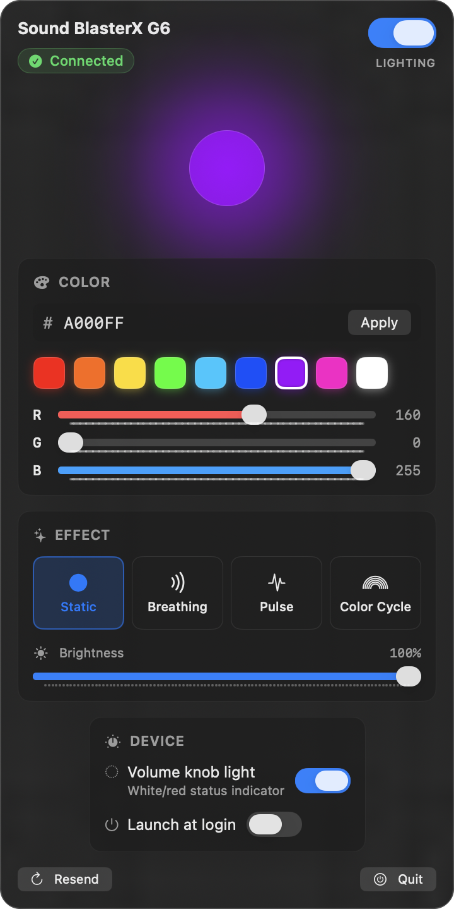

# G6 Lighting

[](https://github.com/reminirestore-arch/G6Lighting/actions/workflows/tests.yml)
[](https://codecov.io/gh/reminirestore-arch/G6Lighting)
[](https://github.com/reminirestore-arch/G6Lighting/releases/latest)


[](LICENSE)

Native macOS menu-bar app that controls the RGB X-logo and the volume-knob LED ring of the **Creative Sound BlasterX G6** USB sound card. Creative ships no macOS software for this device — this app fills the gap, talking to the G6's vendor-specific HID interface directly.

<p align="center">
  
</p>

| | |
|---|---|
| Platform | macOS 14+ (Apple Silicon) |
| Build | Swift Package Manager (no Xcode required) |
| Privileges | None — userspace HID, no kext, no DriverKit, no signing |
| Hardware tested | G6 firmware `bcdDevice 0x2014` (VID `0x041E` / PID `0x3256`) |

## Features

- X-logo full RGB color, brightness, four effects (Static / Breathing / Pulse / Color Cycle)
- Live preview that mirrors the exact frame stream sent to the device
- Volume-knob ring LED on/off (newly reverse-engineered protocol; published April 2026)
- Master on/off toggle (preserves color and effect)
- Hex / preset / RGB-slider color editing
- Auto-launch at login (`SMAppService`)
- Auto-resend after USB reconnect and system wake-from-sleep
- Persists all settings between launches

## Build & install

The repository ships a single `build.sh` script that handles everything. No Xcode needed — just the Command Line Tools (`xcode-select --install`).

```bash
git clone git@github.com:reminirestore-arch/G6Lighting.git
cd G6Lighting
./build.sh install        # build + copy to /Applications
```

After install the app is available everywhere a normal Mac app is:

- **Spotlight**: ⌘-Space, type "G6"
- **Launchpad**
- **Finder → Applications**
- Terminal: `open -a G6Lighting`

The app lives in the **menu bar** (lightbulb icon, top-right). It deliberately has no Dock icon (`LSUIElement = true`). To exit: click the lightbulb → **Quit** (⌘Q).

To start automatically at login, open the menu and toggle **Launch at login** — the app registers itself via `SMAppService` and you can review/revoke the permission in **System Settings → General → Login Items**.

### All `build.sh` commands

| Command | Effect |
|---|---|
| `./build.sh` (or `build`) | Compile and assemble `G6Lighting.app` in the project directory only. |
| `./build.sh install` | Build, then copy to `/Applications` and clear the quarantine attribute. |
| `./build.sh uninstall` | Remove `/Applications/G6Lighting.app`. (Disable login-item separately in System Settings.) |
| `./build.sh dmg` | Build, then package `G6Lighting.dmg` for sharing. |
| `./build.sh clean` | Delete `.build/`, the local `.app`, and any `.dmg`. |
| `./build.sh help` | Show the same list. |

### Code signing & Gatekeeper

The script ad-hoc signs the bundle (`codesign --sign -`) which is enough for the local machine. `install` also strips the `com.apple.quarantine` xattr so the first launch doesn't trigger a Gatekeeper prompt.

If you share the `.dmg` with someone else, the recipient will need to run this once before launching:

```bash
xattr -dr com.apple.quarantine /Applications/G6Lighting.app
```

For frictionless distribution to many users, sign with a **Developer ID Application** certificate ($99/yr Apple Developer account) and notarize via `notarytool`. See Apple's [signing docs](https://developer.apple.com/documentation/security/notarizing_macos_software_before_distribution) — the ad-hoc `codesign` line in `build.sh` is the swap point.

## Architecture

Layered, with each layer depending only on layers below it:

```
App           — @main entry point + composition root
 └─ G6LightingApp.swift
    ├─ AppEnvironment  (DI for the whole app)
    ├─ ContentView     (composition of UI sections)
    └─ LightingViewModel
        │
State    — observable presentation state, persistence
        ├─ SettingsStore       (backed by KeyValueStore protocol)
        ├─ LightingViewModel   (effect runner + system-monitor wiring)
        └─ EffectPlayer        (single source of truth for "current frame")
        │
Domain   — pure, side-effect-free models and algorithms (no AppKit/IOKit)
        ├─ Models    (RGBColor, LightingFrame, LightingMode)
        └─ Effects   (LightingEffect protocol + Static/Breathing/Pulse/Cycle)
        │
Hardware — wire protocol + HID transport (mockable)
        ├─ G6Protocol         (byte-exact packet builders)
        ├─ HIDTransport       (protocol)
        ├─ IOKitHIDTransport  (real macOS implementation)
        ├─ MockHIDTransport   (in-memory recorder for tests)
        └─ G6Device           (high-level API: setColor, setRingLed, disableLogo)
        │
System   — OS integration
        ├─ DeviceMonitor      (USB connect/disconnect via IOHIDManager)
        ├─ WakeMonitor        (NSWorkspace.didWakeNotification)
        └─ AutoLaunch         (SMAppService)
```

Source layout follows the layers — each lives in `Sources/G6LightingCore/<Layer>/`.

## Testing

```bash
swift run G6LightingTestRunner --testing-library swift-testing
```

46 tests across 7 suites cover:

- Wire-protocol byte exactness (every packet field, BGR order, RGB-frame composition)
- Effects as pure functions (peak frames at chosen times, period correctness)
- Settings persistence with an in-memory `KeyValueStore`
- ViewModel integration: startup, on/off, ring-LED, error surfacing, color resend

Why a custom runner: standard `swift test` on Command Line Tools-only setups (no Xcode) builds a Mach-O bundle that cannot be executed directly, so swift-testing's entry point is never invoked. The dedicated `G6LightingTestRunner` executable target wraps `Testing.__swiftPMEntryPoint()` and produces real output.

## Wire protocol

All commands go to **HID interface 4** (vendor usage page `0xFF00`) as 64-byte HID OUTPUT reports via `IOHIDDeviceSetReport`. Interface 4 has no OUT endpoint, so writes are routed through the SET_REPORT control transfer transparently.

### X-logo color (3 packets)

| | bytes |
|---|---|
| init | `5A 3A 02 06 01 …` |
| mode | `5A 3A 06 04 . 03 01 . 01 …` |
| color | `5A 3A 09 0A . 03 01 01 {bri} {B} {G} {R} …` |

### Volume-knob ring LED toggle (DATA + COMMIT)

| | bytes |
|---|---|
| DATA  | `5A 39 03 00 0E {00=on, 01=off} …` |
| COMMIT | `5A 39 01 01 …` |

The volume-knob LED is **bicolor (white/red)** in hardware, not RGB — only on/off is exposable. White = playback volume, red = sidetone.

## Acknowledgements

- [`nils-skowasch/soundblaster-x-g6-cli`](https://github.com/nils-skowasch/soundblaster-x-g6-cli) — Linux CLI that documented the HID framing
  - Issue [#4](https://github.com/nils-skowasch/soundblaster-x-g6-cli/issues/4) by **Kaan88** (April 2026) — first public capture of the ring-LED toggle packets
- [OpenRGB MR !451](https://gitlab.com/CalcProgrammer1/OpenRGB/-/merge_requests/451) — independent reverse of the X-logo color path

## Scope & related projects

**G6 Lighting** is intentionally a small, focused app — only RGB and ring LED. It will stay that way.

If you want **full G6 management** (lighting + audio DSP: output toggle, SBX effects, mic boost, etc.):

- A larger companion app **G6 Control** is planned for macOS — separate repo, will coexist with this one. Both will be installable side-by-side and use disjoint G6 HID command families. See [issue #1](https://github.com/reminirestore-arch/G6Lighting/issues/1) and [`docs/G6Control-roadmap.md`](docs/G6Control-roadmap.md). Not started yet.
- On Linux / Windows today: [`jackbrumley/rusty-g6`](https://github.com/jackbrumley/rusty-g6) — feature-complete audio GUI, MIT, identical wire protocol.

Pick whichever fits your use case — neither is a replacement for the other.

## Contributing

PRs welcome — see [CONTRIBUTING.md](CONTRIBUTING.md). For bugs and feature requests, please use the [issue tracker](https://github.com/reminirestore-arch/G6Lighting/issues).

## License

[MIT](LICENSE) — do whatever you want, just keep the copyright notice.

Not affiliated with or endorsed by Creative Technology Ltd. The Sound Blaster name and product names are trademarks of Creative Technology Ltd.
